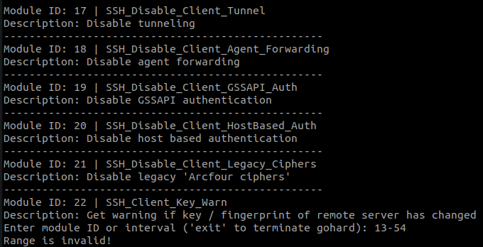

# gohard

gohard (golang harden) is a partial rewrite of [grapheneX](https://github.com/grapheneX/grapheneX), which I also try to actively maintain.
The goal was to get rid of all third party libs (not successful), and only have a CLI app.

I started learning Golang recently, so I thought this would be a good practice.

### Build

64-bit linux

```shell
GOOS=linux GOARCH=amd64 go build -o bin/
```

64-bit windows

```shell
set GOOS=windows GOARCH=amd64
go build
```

There's a possibility that Microsoft Defender will flag this binary as malicious and refuse to execute it.
[Disabling real-time protection](https://support.microsoft.com/en-us/windows/turn-off-defender-antivirus-protection-in-windows-security-99e6004f-c54c-8509-773c-a4d776b77960) is a <b>must-do</b> in order to run.

---

[UNIX] Create a symlink for gohard binary:

```shell
sudo apt-get install -y coreutils
sudo ln -s $(readlink -f bin/gohard) /usr/local/bin
```

### Usage

[UNIX] Help message:

```shell
gohard -h
```

[UNIX] Use SSH hardening modules:

```shell
sudo -E gohard --service=ssh
```

[UNIX] Use Kernel hardening modules

```shell
sudo -E gohard --service=kernel
```

[WINDOWS] Use firewall hardening modules

```shell
cmd /k gohard.exe --service=firewall
```

And basically the same way for all the other services.

You can use 'ranges' to execute more than 1 module at the same time:


If you enter either wrong start / end index, gohard will exit:



You can also execute all available modules using '-':


If any command doesn't finish successfully gohard will throw out an error, but will continue with the execution of all
remaining modules:


